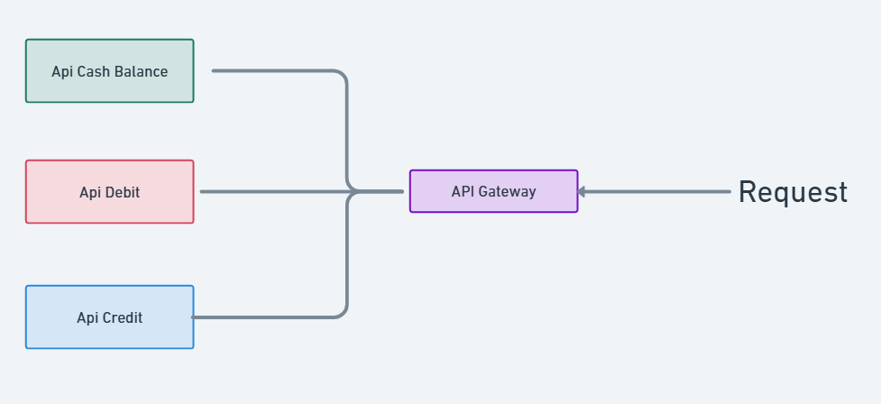
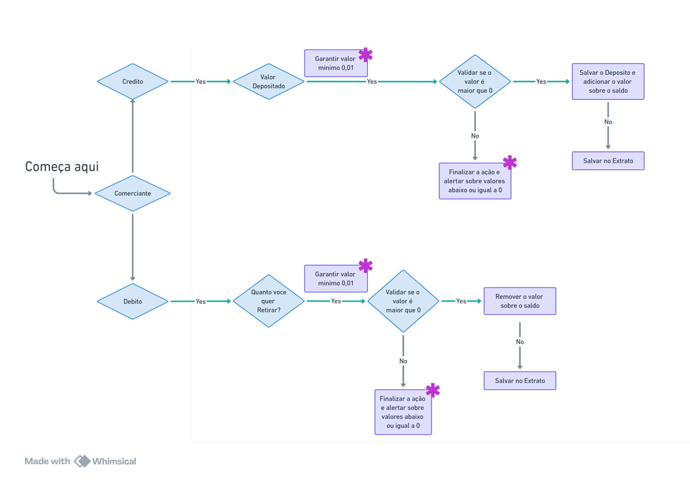

# Documentação em Construção

### Aplicação Fluxo de Caixa

## Indice

- [Introdução](#Introducao)
- [Fluxo da Solução](#fluxo-solucao)
- [Fluxo de Negocio](#Fluxo-de-Negocio)
- [Arquitetura do Projeto](#Arquitetura-do-Projeto)
- [Instrução](#Instrucao)

## Introducao
Essa aplicação representa o **core domain** do nosso sistema, concentrando a lógica mais valiosa e complexa do nosso negócio de fluxo de caixa diário. Cada comerciante terá um caixa individual para registrar entradas e saídas de dinheiro, garantindo um controle financeiro preciso. Além disso, a aplicação gerará relatórios diários detalhados, oferecendo uma visão clara e organizada das transações realizadas.

### Descritivo da Solução
Um comerciante precisa controlar o seu fluxo de caixa diário com os lançamentos (débitos e créditos), também precisa de um relatório que disponibilize o saldo
 diário consolidado.
## Fluxo da Solucão
Seguindo a arquitetura de Microsserviços, separamos os serviços da seguinte forma(segue imagem abaixo):


| Serviço           | Responsabilidade                                                 |
|------------------|-----------------------------------------------------------------|
| **API Credit**   | Adicionar dinheiro ao caixa                                    |
| **API Debit**    | Remover (debitar) dinheiro do caixa                            |
| **API Cash Balance** | Gerenciar o caixa geral, fornecer extratos, relatórios e cadastrar comerciantes |
| **API Gateway**  | Processar, monitorar e controlar as chamadas de API           |

## Fluxo de Negocio

## Arquitetura do Projeto
Seguindo arquitetura DDD, e pensando na escabilidade horizontal(scale-out) e na distribuição de carga para multiplos serviços foi usado o Microsserviços.

### Arquitetura de DDD

A nossa arquitetura segue os princípios do Domain-Driven Design (DDD) organizando a solução em diferentes contextos delimitados (Bounded Contexts). Cada API representa *um contexto específico*, garantindo separação de responsabilidades e independência entre os domínios.

Lembrando 
```
Api Fluxo de Caixa
├── ApiBalance.Test #Testes automatizados
├── ApiCashBalance #Camada de Apresentação (Controllers, Endpoints)(Api)
├── CashBalance.Application #Camada de Aplicação (Orquestração, DTOs, Use Cases)
├── CashBalance.Domain #Camada de Domínio (Entidades, Regras de Negócio, Interfaces)
└── CashBalance.Infrastructure #Camada de Infraestrutura (Repositórios, Banco, Serviços Externos)

Api Credito
├───ApiCredit.Test #Testes automatizados
├───ApiCredit #Camada de Apresentação (Controllers, Endpoints)(Api)
├───ApiCredit.Application #Camada de Aplicação (Orquestração, DTOs, Use Cases)
├───ApiCredit.Domain #Camada de Domínio (Entidades, Regras de Negócio, Interfaces)
└───ApiCredit.Infrastructure #Camada de Infraestrutura (Repositórios, Banco, Serviços Externos)

Api Debit
├───ApiDebit.Test #Testes automatizados
├───ApiDebit #Camada de Apresentação (Controllers, Endpoints)(Api)
├───ApiDebit.Application #Camada de Aplicação (Orquestração, DTOs, Use Cases)
├───ApiDebit.Domain #Camada de Domínio (Entidades, Regras de Negócio, Interfaces)
└───ApiDebit.Infrastructure #Camada de Infraestrutura (Repositórios, Banco, Serviços Externos)
```

## Instrução

### Pré-requisito
Antes de rodar o projeto, certifique-se de ter instalado:

```.NET SDK 8.0```
Docker (caso precise rodar dependências como banco de dados)

### Rodando a Aplicação
**Restaure as dependências**
```dotnet restore```

**Para rodar a API principal:**

```cd ApiCashBalance```

```dotnet run```

**Para rodar os testes:**

```cd ApiBalance.Test```

```dotnet test```


## Futuras Melhorias